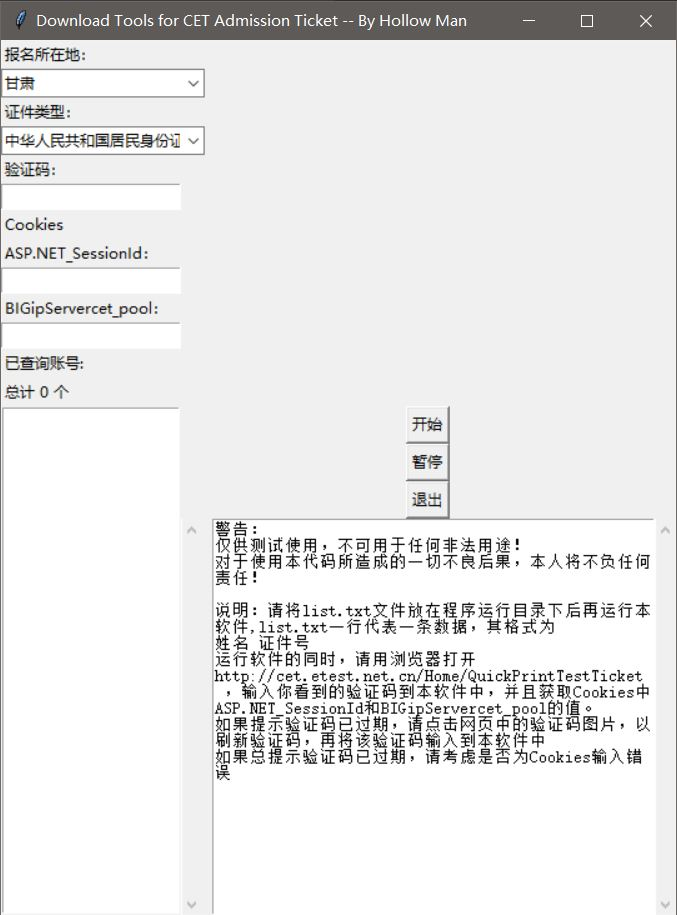

# Download-Tools-for-CET-Admission-Ticket

This is a Download Tool Coded Using Python Tkinter to Batch Download CET Admission Ticket（CET准考证批量下载工具）

[Win程序:](Download-Tools-for-CET-Admission-Ticket.exe) 

 

[脚本](Download-Tools-for-CET-Admission-Ticket.py)

采用Python多线程Tkinter UI编程！

说明：请将list.txt文件放在程序运行目录下后再运行本软件,list.txt一行代表一条数据，其格式为

```text
姓名 证件号
... ...
```

运行软件的同时，请用浏览器打开[CET快速打印准考证网站](http://cet.etest.net.cn/Home/QuickPrintTestTicket)，输入你看到的验证码到本软件中，并且获取Cookies中ASP.NET_SessionId和BIGipServercet_pool的值。如果提示验证码已过期，请点击网页中的验证码图片，以刷新验证码，再将该验证码输入到本软件中。如果总提示验证码已过期，请考虑是否为Cookies输入错误

**警告**：

***仅供测试使用，不可用于任何非法用途！***

***对于使用本代码所造成的一切不良后果，本人将不负任何责任！***

[Windows Program](Download-Tools-for-CET-Admission-Ticket.exe)

[Script](Download-Tools-for-CET-Admission-Ticket.py)

Using Python multithreading programming, UI Coded with Tkinter

Note: Please put the list.txt file in the program running directory before running the software. The list.txt line represents a data in the format of:

```text
Name ID
... ...
```

While running the software, open [CET Fast Admission Ticket Print](http://cet.etest.net.cn/Home/QuickPrintTestTicket) with a browser.
Enter the validation code you see into this software and get the values of ASP.NET_SessionId and BIGipServercet_pool in Cookies.
If the prompt verification code has expired, please click on the picture of the verification code in the web page to refresh the verification code, and then input the verification code into the software. If the total prompt verification code has expired, please consider whether the error is entered for Cookies.
**Warning**:

***For TESTING ONLY, not for any ILLIGAL USE!***

***I will not be responsible for any adverse consequences caused by using this code.***